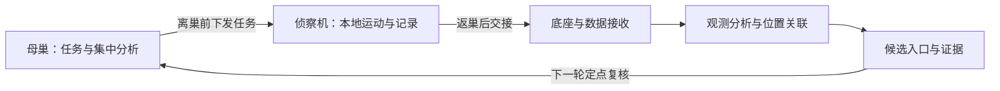

# Nest

**室内蚂蚁出入口定位研究项目：子机离线采集，返巢交接，母巢分析并安排下一轮复核。**

我们希望在地面可接近的室内区域，根据工蚁活动发现实际使用的隐蔽出入口，并留下可以复查的证据。出入口不一定直通蚁巢。

## 当前状态

处于需求、研究证据与工程设计阶段。此仓库提供协作框架和公开数据复算材料，机器人控制、自动视觉识别、返航和对接尚未实现或验证。

- 首版：已有电脑作为母巢，1台标准侦察机与上传底座，完成发现与定点复核闭环。
- 完整目标：2台同型侦察机与1台处理机；双机收益和处理效果需分别验证。
- 暂定入口规则：同一入口在180秒内合计5次实际进入或离开。普通过路、停留、遮挡和检测丢失不算进入。
- 当前研究证据仅支持已知野外活动入口的门槛可达性，不能给出室内准确率或机器人成效。

## 系统框架



离巢期间不依赖实时通信。侦察机须本地执行避障、返航和故障处理；母巢不能远程替它纠偏。

## 从这里开始

1. [开发定义与端到端计划](docs/Nest-development.md)：当前需求、范围、预算、任务状态和验收。普通Markdown也可阅读；VS Code使用 **Markmap: Open as markmap** 查看导图。
2. [架构与模块边界](docs/architecture.md)：责任、输入输出和依赖。
3. [协作说明](CONTRIBUTING.md)：选任务、提交方式和验收要求。
4. [首个软件任务](docs/tasks/P1-offline-handoff.md)：任务下发、数据交接和复核任务生成。
5. [公开入口证据](docs/research/Nest_ant_entry_evidence_2026-10-05.md)与[复算方法](docs/research/README.md)。

## 目录

```text
src/nest/              当前系统模块边界；各模块README明确未实现状态
examples/handoff/      P1接口草案的人工样例，不是机器人运行结果
docs/architecture.md   系统边界
docs/interfaces.md     任务、交接、证据及复核接口草案
docs/tasks/            可认领任务及验收
docs/research/         相关研究、来源、复算脚本与数据
docs/Nest-development.md  当前需求、Markmap计划及进展
.github/               Issue与PR模板
```

## 加入项目

可参与母巢与数据交接、侦察机控制与返航、视觉与事件识别、定位与坐标关联、底座与电源设计、实验评价。先选一个有明确输入输出与验收的小任务，在Issue中提出方案，再通过PR提交。

当前最先推进 **P1离线交接闭环**；P0计划仍待负责人审阅。硬件采购、算法升级和双机扩展需要对应证据与设计决定。

## 可以运行什么

当前可运行的是公开数据复算，详见[研究说明](docs/research/README.md)。模块框架尚无机器人或母巢启动命令；接口样例不代表P1已经实现。

原CSP练习、污染源演示、作业绘图及旧视频已移出当前工作树发布范围，保留在本地归档及已有Git历史中。

项目代码许可尚未选定；第三方研究材料按其原始来源与许可使用。贡献前由负责人明确许可安排。
